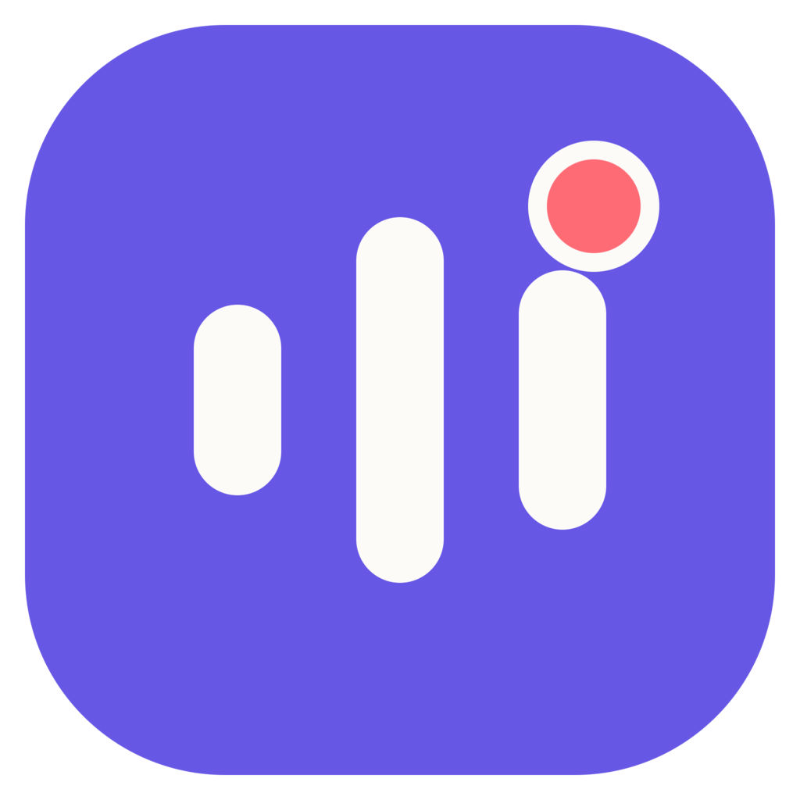

<p align="center">
  
</p>

<h1 align="center">isTranscribe</h1>

<p align="center">Meeting recordings that stay on your computer.</p>

<p align="center">
  English · <a href="README.ru.md">Русский</a> · <a href="docs/BUILDING.md">Build from source</a> · <a href="LICENSE">MIT license</a>
</p>

isTranscribe sits in the tray, notices when a meeting may have started, and asks whether to record. When the meeting ends, the audio goes to a folder you choose. You can also start a recording yourself.

Transcription has three modes: off, local Whisper, or online with your own Groq or OpenRouter key. The speaker pipeline uses separate microphone and system audio tracks to distinguish you from the people on the call.

## Where the project stands

This is an early source release. The code includes recording, transcription, and packaging tools; manual acceptance for meeting detection, provider setup, and speaker accuracy is still open. The [work board](specs/BOARD.md) records the details.

| Platform | Current state |
| --- | --- |
| Windows x64 | Main development target; MSIX packaging and CPU/Vulkan transcription paths are available. |
| macOS on Apple Silicon | App/DMG tooling and native adapters are included; platform acceptance is in progress. |
| Linux, Windows ARM64, Intel Mac | No supported build path yet. |

The first public release contains source code. A signed installer will have its own release when it is ready.

## A few useful details

- Recording starts after your confirmation or a manual action. A compact floating widget keeps the controls within reach.
- Audio stays in your chosen folder. A failed transcription leaves the recording available.
- Local transcription uses Whisper `large-v3-turbo`. The app downloads model files separately from its installer.
- Online transcription uses your provider account. It sends audio after opt-in and may incur charges from that provider.
- The interface is available in English and Russian.

There is no isTranscribe account to create. [Data and privacy](docs/PRIVACY.md) explains what is stored and when the app connects to external services.

## Try the source

On Windows, install Git and the .NET 10 SDK selected by [global.json](global.json), then open PowerShell:

```powershell
git clone https://github.com/N1arko/istranscribe.git
cd istranscribe
dotnet run --project src/IsTranscribe.App.Windows/IsTranscribe.App.Windows.csproj -c Release -r win-x64
```

This starts the desktop app. Local transcription also needs the worker and native libraries included by the full packaging workflow. The [build guide](docs/BUILDING.md) covers those steps and the macOS build.

## Help shape it

A reproducible bug report is useful: your OS, what you did, and what happened. Ideas and pull requests are welcome too. The [contribution guide](CONTRIBUTING.md) explains where to start; [private security reports](SECURITY.md) have a separate route.

The app is written in C# with .NET 10 and Avalonia. Shared logic lives in `src/IsTranscribe.Application` and `src/IsTranscribe.Core`; platform adapters handle capture and desktop integration. Product decisions live in the [specification map](specs/SPEC-MAP.md).

## License and credits

isTranscribe is released under the [MIT license](LICENSE). You can use, modify, and distribute it, including commercially, while keeping the license and copyright notice.

Whisper, sherpa-onnx, Avalonia, and the other dependencies have their own licenses. [Third-party materials](docs/THIRD_PARTY.md) points to the notices and model terms.
